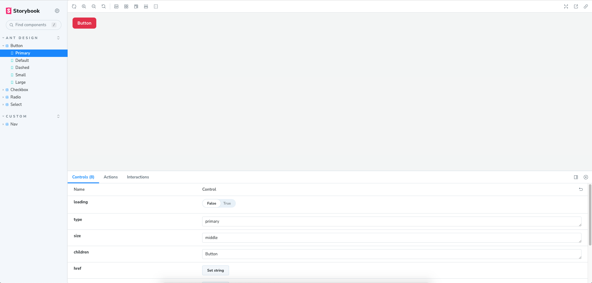

# React react-query Antd Boilerplate

This boilerplate is starting point of any project that uses `antd` and `react-query` with all batteries included. you can directly start development without spending time on project setup.

## Things to update in this boilerplate

- update readme file to remove/add project related documenation.
- update `name` key in `package.json` file
- update git remote using `git remote set-url origin new.git.url/here` command
- remove [Things to update in this boilerplate](#things-to-update-in-this-boilerplate) and [Demo](#demo) section from this file
- remove `/public/React-Antd-RQ.png`, `/public/storybook.png`, `/public/react-antd-rq.gif` and other unnecessary files.

## Tech Stack

**Client:** [React](react.dev), [Typescript](https://www.typescriptlang.org), [Vite](https://vitejs.dev/), [React-Query](https://tanstack.com/query/latest), [react router](https://reactrouter.com/en/main)

**Styling** [Antd](https://ant.design/), [styled-components](https://styled-components.com/), [storybook](https://storybook.js.org/)

**HTTP Client** [axios](https://axios-http.com/)

**Internationalization** [i18next](https://react.i18next.com/)

**Code Formatter** [Eslint](https://eslint.org/) + [prettier](https://prettier.io/) + [husky](https://typicode.github.io/husky)

## Documentation

### Project Setup

`Clone URL : https://github.com/dhavalk-simform/react-antd-rq-boilerplate.git`

Clone repo using HTTP or SSH method.

To use SSH method, please [Follow this tutorial](https://docs.github.com/en/authentication/connecting-to-github-with-ssh)

To use HTTP method, developer has to pass username in git clone url like this `https://{username}@github.com/dhavalk-simform/react-antd-rq-boilerplate.git`
It will promte for application password that you can generate from [here](https://github.com/settings/tokens)

run `npm i` command

copy `.env.example` to `.env`. update `.env` file variables. make sure in this process you don't rename/delete `.env.example` file.

run `npm run dev` command to start development server.

### other useful scripts

- `npm run build` to build a project
- `npm run preview` to run build preview
- `npm run lint` to check linting issues
- `npm run lint:fix` to fix linting issues
- `npm run storybook` to start storybook development server
- `npm run build-storybook` to build storybook

### Developer Guide

- first thing to set your git username and email using `git config user.name "{username}"` and `git config user.email "{email}"` command
- Never push/commit directly to `main` branch.
- Branch name should be start with `feature/feature-name`, `bug/bug-details` or `design/design-details`
- commit message should be in `Ticket number : Title` format only.  for example `T-101 : Deploy site on production env.`
- verify and solve linting issues by running `npm run lint` and `npm run lint:fix` before commit.
- Single PR should have only single commit. If you did multiple commits then rebase all commits to single commit before raising PR.
- Have added comments when requried for better understanding and what you can do more on it.
- update eslint rules in .eslintrc.cjs file as per requirement.

## Demo

